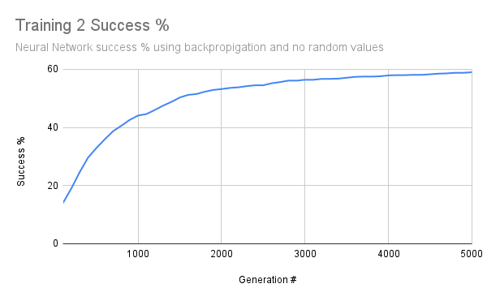
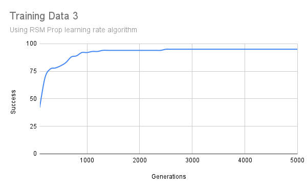
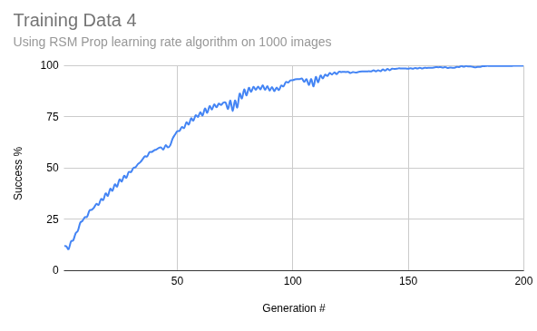

# Heimdall
This project implements a handwritten digit recognition system using RSM (Reservoir State Machine) propagation.

The system focuses on simplicity and efficiency, making it a useful experimental and educational approach compared to more conventional or advanced deep learning methods.

# Features
- Recognizes handwritten digits (0–9)
- Uses reservoir-based propagation instead of backprop-heavy deep networks
- Lightweight and efficient for experimentation
- Modular design for easy extension and testing
- Works with a dataset of handwritten number images

# How It Works
## 1. Input Processing
- Normalized (grey-scaled, resized)
- Flattened (converted into a single sequence representing the image)
## 2. Neural Network Initialization
- All nodes (except for the input layer) are created with random bias and weight, value and error margin are set to 0 (calculated with each update)
- Nodes are organized into layers, and layers into the neural network object
## 3. RSM Propagation
- The input is propagated through the neural network using iterative state updates
- Each input influences the neural network's state
- Previous states contribute to future states
- This creates a state that encodes features of the handwritten digit
## 4. Output Layer
- Based on the previous layers' data, nodes in the output layer are given values
- The output node with the highest value is the most probable choice according to the network
- The actual value of the image is compared to the determined output, and the margin of error is propagated backwards through the network, and all values are updated accordingly

# Results Showcase

Results of machine learning algorithm generated by Chat-GPT

Results of RSM Back-propagation Algorithm On 100 Images

Results of RSM Back-propagation Algorithm On 1000 Images
